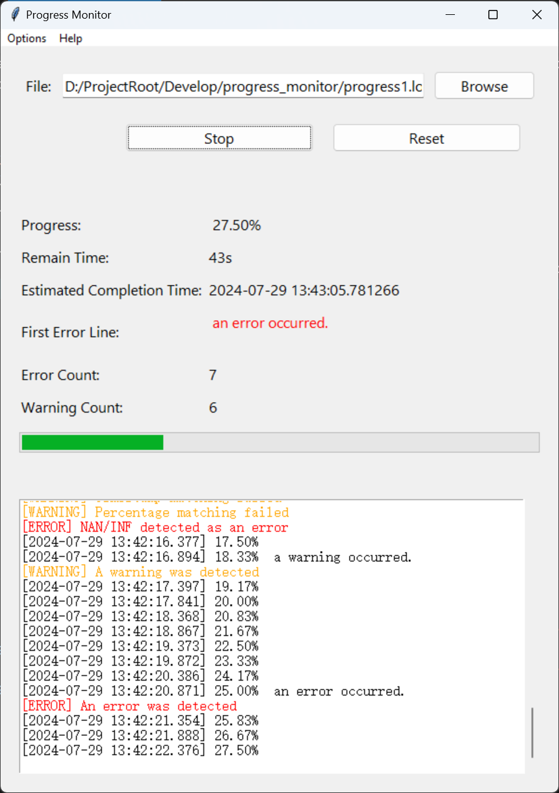
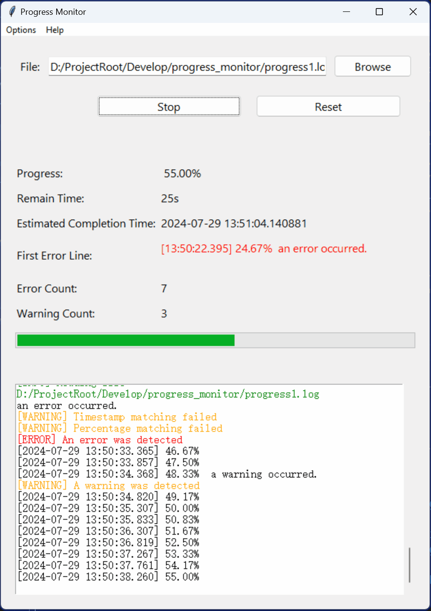

# 进度监控脚本 progress-monitor

本工具使用 Python Tkinter 实现 GUI，用于监控科学计算程序的日志文件，提供进度展示与统计功能。

## 背景

在科学计算程序运行过程中，了解进度信息十分重要。然而，大部分科学计算程序（如 C/C++/Fortran 编写的程序）无法直接提供图形化进度条。

为此，可采用间接方法：让程序将时间戳和进度（例如 `[2024-07-28 23:24:46.769] 4.17%`）写入日志文件，然后通过本工具监控该文件。

这样做的好处是：科学计算程序与进度监控过程相分离，简化了程序编写，并避免了对输出内容的干扰。

## 主要功能

- **实时展示日志**：类似 `tail -f` 命令，实时显示日志文件新增内容。
- **解析与展示进度**：自动解析时间戳（格式为 `[2024-07-28 23:24:46.769]`）和进度百分比（格式为 `0-100%`），并以进度条形式展示。
- **时间预测**：基于当前进度和历史数据，通过指数平滑预测剩余时间及完成时间。
- **关键字检测**：
  - 自动检测 `error`、`warning`、`inf`、`nan` 等关键字，显示并计数错误/警告信息。
  - 检测 `end` 或 `finish` 关键词，标记进度结束。
  - 记录并在界面显示首个错误信息，便于进行错误分析。

## 使用方法

1. 运行脚本：`python progress_monitor.py`
2. 点击“浏览”按钮选择日志文件。
3. 点击“开始/停止”按钮开始或停止监控所选日志文件。
4. 点击“重置”按钮停止监控并重置所有数据与显示信息。

## 示例

